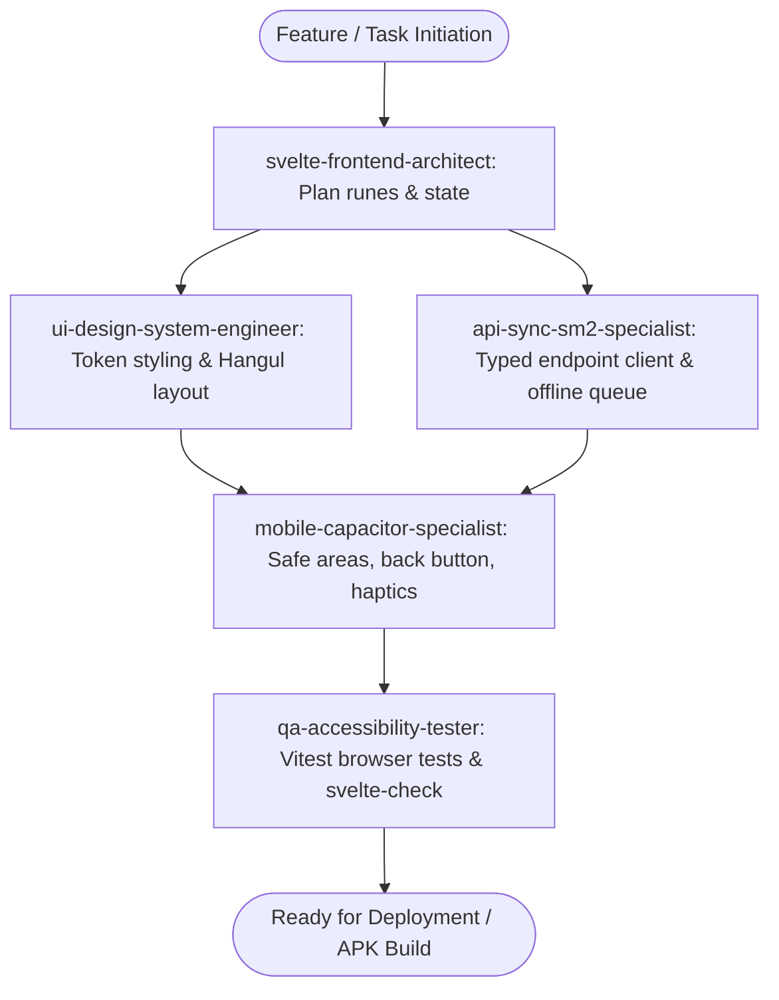

# VOABKR Frontend Agent Workforce

This directory houses the specialized AI agent profiles designed for the `voabkr-frontend` repository. Each agent possesses domain-specific skills, strict conventions, and verification protocols tailored to SvelteKit 2, Svelte 5 Runes, Capacitor Android packaging, and the Go/Gin backend.

---

## Agent Roster

| Agent Name                        | Primary Specialty                            | Key Technologies                                                          | Location                                                                                                                                   |
| :-------------------------------- | :------------------------------------------- | :------------------------------------------------------------------------ | :----------------------------------------------------------------------------------------------------------------------------------------- |
| **`svelte-frontend-architect`**   | Component architecture & Svelte 5 Runes      | Svelte 5 (`$state`, `$derived`, `$props`), SvelteKit 2, TypeScript        | [agent.md](file:///home/fankhauserli/Work/git/github.com/Fankhauserli/voabkr-frontend/.agents/agents/svelte-frontend-architect/agent.md)   |
| **`mobile-capacitor-specialist`** | Android lifecycle & Capacitor bridge         | Capacitor 6+, Android WebView, `@capacitor/haptics`, Safe Areas           | [agent.md](file:///home/fankhauserli/Work/git/github.com/Fankhauserli/voabkr-frontend/.agents/agents/mobile-capacitor-specialist/agent.md) |
| **`ui-design-system-engineer`**   | Editorial Korean paper aesthetic & Tailwind  | Tailwind CSS v4, Hangul Typography, 3D CSS Card Flips                     | [agent.md](file:///home/fankhauserli/Work/git/github.com/Fankhauserli/voabkr-frontend/.agents/agents/ui-design-system-engineer/agent.md)   |
| **`api-sync-sm2-specialist`**     | Backend sync, Redis cookies & SM-2 algorithm | Go Gin API, Redis Sessions, SuperMemo SM-2, IndexedDB queue               | [agent.md](file:///home/fankhauserli/Work/git/github.com/Fankhauserli/voabkr-frontend/.agents/agents/api-sync-sm2-specialist/agent.md)     |
| **`qa-accessibility-tester`**     | Testing, accessibility & type auditing       | Vitest (`vitest-browser-svelte`), Playwright, WCAG 2.2 AA, `svelte-check` | [agent.md](file:///home/fankhauserli/Work/git/github.com/Fankhauserli/voabkr-frontend/.agents/agents/qa-accessibility-tester/agent.md)     |

---

## Agent Collaboration Workflow

