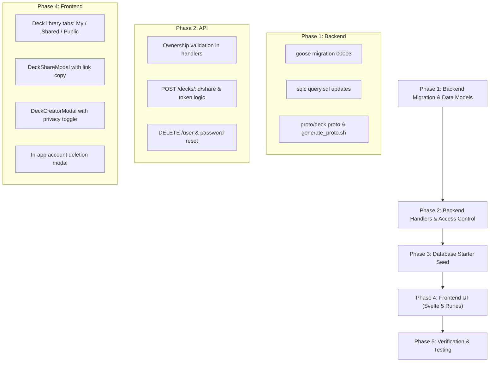

# voabkr — Deck Ownership, Privacy & Sharing Architecture

This document specifies the architectural transition of **voabkr** from a global deck model to a multi-tenant, access-controlled platform supporting **public decks, private decks, deck owners, and peer sharing**, as well as the remaining completion features (password reset, account erasure, seed content, and PWA offline support).

---

## 1. Architectural Motivation

Currently, the `decks` table contains only `id`, `name`, `type`, and timestamps. All decks are globally visible to all users, with no concept of an author or privacy boundary.

To support:
1. **Private Decks**: Decks authored by a learner visible only to them.
2. **Public Decks**: Curated or community decks visible in the public catalog and to guests.
3. **Deck Ownership**: Ability for the owner to edit, add cards, change visibility, or delete their deck.
4. **Peer Sharing**: Explicitly sharing a private deck with other users via email or a secure share link.

The system requires:
- Database schema changes (foreign keys, visibility flags, share tables).
- Multi-tenant authorization in the Go API (`voabkr-backend`).
- Updates to Protocol Buffer schemas and caching invalidation logic.
- Svelte 5 frontend UI for deck creation, privacy toggles, library filters, and sharing modals.

---

## 2. Database Schema (`voabkr-backend`)

### Migration: `00003_add_deck_ownership_and_sharing.sql`

```sql
-- +goose Up

-- 1. Add ownership and visibility to decks
ALTER TABLE decks 
    ADD COLUMN owner_id BIGINT REFERENCES users(id) ON DELETE SET NULL,
    ADD COLUMN is_public BOOLEAN NOT NULL DEFAULT FALSE,
    ADD COLUMN share_token VARCHAR(64) UNIQUE;

-- Existing system decks remain system-owned (owner_id = NULL) and public
UPDATE decks SET is_public = TRUE WHERE owner_id IS NULL;

-- 2. Create Deck Sharing / Collaborator Table
CREATE TABLE deck_shares (
    id BIGSERIAL PRIMARY KEY,
    deck_id BIGINT NOT NULL REFERENCES decks(id) ON DELETE CASCADE,
    user_id BIGINT REFERENCES users(id) ON DELETE CASCADE,
    invited_email TEXT,
    permission VARCHAR(20) NOT NULL DEFAULT 'view', -- 'view' (study only) | 'edit' (collaborative)
    created_at TIMESTAMPTZ NOT NULL DEFAULT NOW(),
    updated_at TIMESTAMPTZ NOT NULL DEFAULT NOW(),
    UNIQUE(deck_id, user_id)
);

-- 3. Indexes for high-performance access checks
CREATE INDEX idx_decks_owner_id ON decks(owner_id);
CREATE INDEX idx_decks_is_public ON decks(is_public);
CREATE INDEX idx_decks_share_token ON decks(share_token);
CREATE INDEX idx_deck_shares_user_id ON deck_shares(user_id);
CREATE INDEX idx_deck_shares_deck_id ON deck_shares(deck_id);

-- +goose Down
DROP TABLE IF EXISTS deck_shares;
ALTER TABLE decks DROP COLUMN IF EXISTS share_token;
ALTER TABLE decks DROP COLUMN IF EXISTS is_public;
ALTER TABLE decks DROP COLUMN IF EXISTS owner_id;
```

---

## 3. Backend Access Control & API Endpoints

### 3.1 Deck Retrieval Logic
When a user requests decks via `GET /api/v1/decks/`:
- **Unauthenticated (Guests)**:
  ```sql
  SELECT * FROM decks 
  WHERE is_public = TRUE AND deleted_at IS NULL 
  ORDER BY name;
  ```
- **Authenticated (User ID `$1`)**:
  ```sql
  SELECT DISTINCT d.*, 
    CASE 
      WHEN d.owner_id = $1 THEN 'owner'
      WHEN s.permission IS NOT NULL THEN s.permission
      ELSE 'public'
    END AS user_access_role
  FROM decks d
  LEFT JOIN deck_shares s ON d.id = s.deck_id AND s.user_id = $1
  WHERE d.deleted_at IS NULL AND (
      d.is_public = TRUE 
      OR d.owner_id = $1 
      OR s.user_id = $1
  )
  ORDER BY d.name;
  ```

### 3.2 Authorization Matrix

| Action | Owner | Collaborator (`edit`) | Shared User (`view`) | Public Guest |
| :--- | :---: | :---: | :---: | :---: |
| **View Cards & Study** | ✅ | ✅ | ✅ | ✅ (Public decks only) |
| **Add / Edit Cards** | ✅ | ✅ | ❌ | ❌ |
| **Share Deck** | ✅ | ❌ | ❌ | ❌ |
| **Change Public/Private**| ✅ | ❌ | ❌ | ❌ |
| **Delete Deck** | ✅ | ❌ | ❌ | ❌ |

### 3.3 New & Updated Endpoints

```
# Decks
GET    /api/v1/decks/                 -> Returns public decks + owned decks + shared decks
POST   /api/v1/decks/                 -> Creates a deck (assigns owner_id = current_user)
PUT    /api/v1/decks/:id              -> Updates deck (Owner or 'edit' permission required)
DELETE /api/v1/decks/:id              -> Deletes deck (Owner only)

# Sharing
POST   /api/v1/decks/:id/share        -> Invites user by email, or generates/returns share_token
GET    /api/v1/decks/shared/:token    -> Previews shared deck info via link
POST   /api/v1/decks/shared/:token/join -> Adds shared deck to user's library
DELETE /api/v1/decks/:id/share/:user_id -> Revokes access (Owner only)

# Account Erasure (GDPR Right to Erasure)
DELETE /api/v1/user                   -> Self-service complete account & data wipe

# Password Reset
POST   /api/v1/forgot-password        -> Sends reset link with secure single-use token
POST   /api/v1/reset-password/:token  -> Validates token and updates password
```

---

## 4. Frontend UI & UX (`voabkr-frontend`)

### 4.1 Deck Library Tabs ([`/decks`](file:///home/fankhauserli/Work/git/github.com/Fankhauserli/voabkr-frontend/src/routes/decks/+page.svelte))
Introduce segmented filter controls:
- **All**: All decks accessible to the learner.
- **My Decks**: Decks where `owner_id === user.id`.
- **Shared with Me**: Private decks shared by peers.
- **Public Catalog**: Curated and community decks.

### 4.2 Visibility Badges on [`DeckCard.svelte`](file:///home/fankhauserli/Work/git/github.com/Fankhauserli/voabkr-frontend/src/lib/components/decks/DeckCard.svelte)
- **Public**: Minimalist globe SVG with label `Public`
- **Private**: Minimalist lock SVG with label `Private`
- **Shared**: Minimalist user group SVG with label `Shared`

### 4.3 Deck Creator & Editor Modal
- Enabled for authenticated users to author their own decks.
- Toggle:
  - `[x] Public`: Anyone can discover and study this deck.
  - `[ ] Private`: Only you and invited learners can access.

### 4.4 Deck Share Modal (`DeckShareModal.svelte`)
- **Direct Invite**: Input user email address and select permission (`Can View & Study` or `Can Edit`).
- **Shareable Link**: One-click button to copy unique link:
  `https://vocabkr.voyagera.ch/decks/join?token=sec_7f9a...`

### 4.5 Self-Service Account Deletion ([`/settings`](file:///home/fankhauserli/Work/git/github.com/Fankhauserli/voabkr-frontend/src/routes/settings/+page.svelte))
- Add an in-app "Delete Account" button with a red confirmation modal:
  *"This will permanently wipe your account, study history, and custom decks. This action cannot be undone."*
- Calls `DELETE /api/v1/user`, clears cookies, and redirects home.

### 4.6 PWA Offline Service Worker
- Register a lightweight service worker to cache static assets (HTML, CSS, JS, Pretendard font) for offline web and tablet use.

---

## 5. Curated Starter Content (Database Seed)

To ensure the website launches with immediate educational value without requiring manual data entry:
1. **TOPIK I Essential Vocabulary**: 150 foundational nouns, adverbs, and verbs with bilingual definitions and example sentences.
2. **Essential Korean Verbs & Adjectives**: 100 high-frequency descriptive and action verbs.
3. **Everyday Grammar Patterns**: 50 key conjugations (e.g. `-아/어요`, `-고 싶다`, `-ㄹ 수 있다`, `-아서/어서`).

---

## 6. Implementation Phases



---

*Document created: October 2026 for voabkr*
