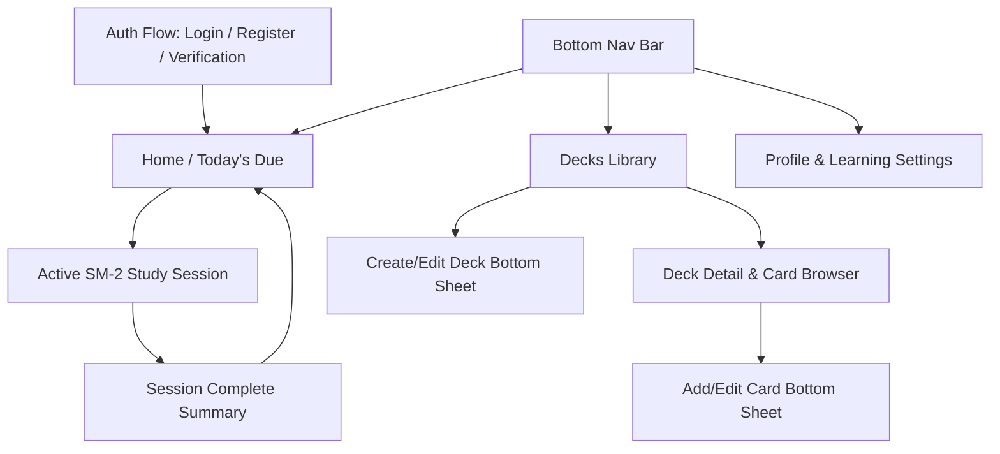
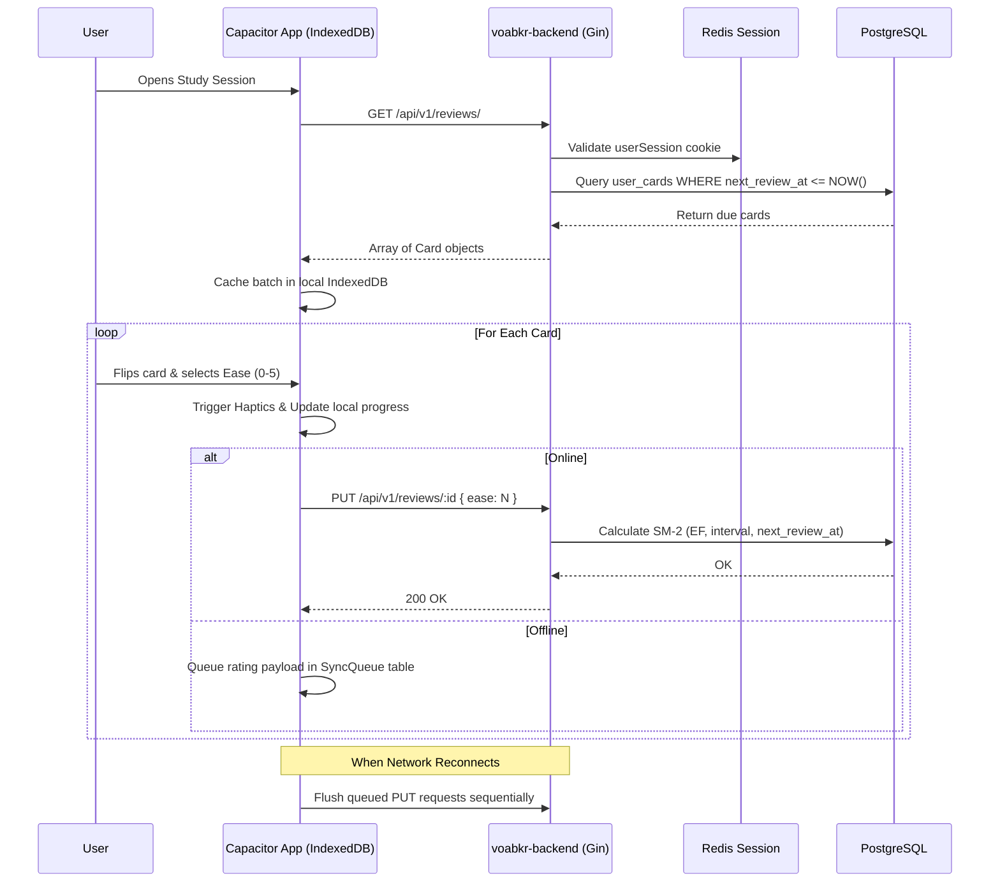

# VOABKR Mobile-First Frontend Specification

**Target Platforms:** Android (via Capacitor) & Mobile Web  
**Backend Reference:** `../voabkr-backend` (Go/Gin + PostgreSQL + Redis Session Auth)  
**Document Version:** 1.0.0

---

## 1. Design Philosophy & Anti-"AI-Slop" Manifesto

Modern AI-generated UI designs often suffer from repetitive, soulless cliches: deep violet/indigo gradients (`#0B0F19`), glowing cyan/purple box shadows, transparent glassmorphism with fuzzy unreadable text, and gratuitous rounded blobs.

**VOABKR is intentionally designed against these tropes.**

### Core Tenets

1. **Editorial Craft & Paper Tactility:**
   Inspired by modern Seoul editorial print design, Korean stationery (Midori, Hobonichi), and minimalist typography. The UI feels like a high-density, tactile study notebook.
2. **Hangul-First Typographic Hierarchy:**
   Korean characters (한글) require balanced stroke density, vertical optical alignment, and generous line-height to maintain legibility. Latin typography is paired cleanly (Pretendard / Noto Sans KR paired with Geist or Inter).
3. **Ergonomic One-Handed Reach (Thumb Zone):**
   Designed specifically for mobile devices. Primary actions (card flip, SM-2 difficulty ratings, deck creation triggers) live in the lower 40% of the screen. Navigation is anchored to a native-feel bottom bar.
4. **Purposeful Contrast over Decorative Glows:**
   High-contrast, warm stone and sumi-ink tones with crisp 1px borders, subtle paper-grain elevation, and purposeful semantic accents.

---

## 2. Color System & Design Tokens

The palette references natural East Asian material culture: **Hanji (traditional paper)**, **Sumi ink**, **Celadon jade**, and **Earthen terracotta**.

### 2.1 Palette Tokens

#### Light Theme (Warm Hanji Notebook)

| Token                   | Hex       | Role & Usage                                             |
| :---------------------- | :-------- | :------------------------------------------------------- |
| `--bg-canvas`           | `#F8F6F0` | Main application background (soft unbleached paper tone) |
| `--bg-surface`          | `#FFFFFF` | Cards, bottom sheets, navigation bars                    |
| `--bg-surface-elevated` | `#F1EFEA` | Card backs, nested wells, disabled button states         |
| `--border-subtle`       | `#E5E0D6` | Standard structural borders (1px solid)                  |
| `--border-strong`       | `#C8C1B4` | Active inputs, card borders during study                 |
| `--text-primary`        | `#1A1917` | High-contrast Sumi ink for Hangul titles & body          |
| `--text-secondary`      | `#5C5850` | Grammar notes, contexts, timestamps                      |
| `--text-muted`          | `#8C867A` | Placeholder text, inactive icons                         |
| `--accent-terracotta`   | `#C85232` | Primary CTA, due card alerts, active streak              |
| `--accent-celadon`      | `#2D6A5D` | Grammar deck badges, successful retention (SM-2 4–5)     |
| `--accent-navy`         | `#1E3A5F` | Vocabulary deck badges, deep structural accents          |
| `--accent-amber`        | `#C88325` | Warning, hesitation ratings (SM-2 2–3)                   |
| `--accent-crimson`      | `#B83232` | Failed card rating (SM-2 0–1), destructive actions       |

#### Dark Theme (Sumi Ink Night)

| Token                   | Hex       | Role & Usage                                       |
| :---------------------- | :-------- | :------------------------------------------------- |
| `--bg-canvas`           | `#121211` | Deep warm charcoal (not harsh OLED pitch black)    |
| `--bg-surface`          | `#1B1A18` | Elevated card surfaces and bottom nav bar          |
| `--bg-surface-elevated` | `#262522` | Card backs, interactive list items on hover/press  |
| `--border-subtle`       | `#2D2B27` | Soft framing borders                               |
| `--border-strong`       | `#45423C` | Focused inputs, card perimeters                    |
| `--text-primary`        | `#EDE9E1` | High-contrast warm off-white for Hangul characters |
| `--text-secondary`      | `#A6A094` | Context tags, english translations, metadata       |
| `--text-muted`          | `#686359` | Disabled states, empty state captions              |
| `--accent-terracotta`   | `#DE6A48` | Warm flame primary action                          |
| `--accent-celadon`      | `#4E9B89` | Soft mint celadon for grammar and high recall      |
| `--accent-navy`         | `#5384B8` | Soft slate blue for vocabulary decks               |
| `--accent-amber`        | `#DF9D38` | Warm ochre for moderate ratings                    |
| `--accent-crimson`      | `#E05252` | Soft crimson for resets & forgotten items          |

### 2.2 SuperMemo SM-2 Rating Scale Palette

Cards use a 6-tier rating system mapped to the backend `PUT /api/v1/reviews/:id` (`ease`: 0–5):

| Ease  | Label      | Short Description               | Button Color (Light)         | Button Color (Dark)          |
| :---: | :--------- | :------------------------------ | :--------------------------- | :--------------------------- |
| **0** | Blackout   | Completely forgotten            | `#FDF2F2` / Border `#E88080` | `#331818` / Border `#8A2E2E` |
| **1** | Wrong      | Incorrect, remembered on reveal | `#FDF5F2` / Border `#E8A280` | `#332018` / Border `#8A4A2E` |
| **2** | Hard-Wrong | Incorrect, almost recalled      | `#FEF9EE` / Border `#E8CA80` | `#332B18` / Border `#8A722E` |
| **3** | Hard       | Correct, severe difficulty      | `#FEFCF0` / Border `#D6D47A` | `#303318` / Border `#7D802B` |
| **4** | Good       | Correct with brief hesitation   | `#F0F8F5` / Border `#80CCA8` | `#183328` / Border `#2E805A` |
| **5** | Easy       | Perfect, immediate recall       | `#EBF5F3` / Border `#60B69F` | `#152B24` / Border `#266B59` |

### 2.3 Typography Specs

- **Primary Hangul Font:** `Pretendard`, `Noto Sans KR`, system-ui
- **Primary Latin Font:** `Pretendard`, `Inter`, system-ui
- **Sizes & Weights:**
  - `Display / Hangul Hero`: 36px / Weight 700 / Line-height 1.3
  - `Heading 1`: 24px / Weight 700 / Line-height 1.3
  - `Heading 2`: 19px / Weight 600 / Line-height 1.35
  - `Body / Translation`: 16px / Weight 400 & 500 / Line-height 1.5
  - `Grammar / Context Chip`: 12px / Weight 600 / Tracking +0.02em / Uppercase
  - `Micro / Badge`: 11px / Weight 600 / Line-height 1.2

---

## 3. Capacitor & Android Native Architecture

Building with Capacitor for Android introduces platform constraints that the frontend architecture must accommodate natively.

### 3.1 Android Safe Areas & System Bars

- Use CSS environment variables for status bar and navigation bar insets:
  ```css
  padding-top: env(safe-area-inset-top, 24px);
  padding-bottom: calc(env(safe-area-inset-bottom, 16px) + 64px); /* Account for bottom nav */
  ```
- **Status Bar Integration:** `@capacitor/status-bar` configured with:
  - `setStyle({ style: isDark ? Style.Dark : Style.Light })`
  - `setBackgroundColor({ color: isDark ? '#121211' : '#F8F6F0' })`
  - `setOverlaysWebView({ overlay: false })`

### 3.2 Redis Session & Cookie Management in Capacitor

The backend uses Redis-backed HttpOnly cookies (`userSession`). In standard Android WebViews, cross-origin or file-origin cookie storage can be blocked or wiped unpredictably.

- **Solution:**
  1. Configure Capacitor's native HTTP handling via `@capacitor/core` / `@capacitor-community/http` or standard Capacitor 5+ plugin:
     ```ts
     CapacitorCookies.setCapacitorCookieHandler();
     ```
  2. Maintain `credentials: 'include'` on all client fetch requests.
  3. Base URL configured via environment (`https://api.yourdomain.com`).

### 3.3 Hardware Back Button & Gesture Navigation

Android users rely on the hardware back button or swipe-from-edge gestures.

- Hook `@capacitor/app` `backButton` event:
  - If a bottom sheet / modal is open $\rightarrow$ Dismiss modal.
  - If inside an active study session $\rightarrow$ Show exit confirmation dialog (don't lose session).
  - If on secondary route (`/decks/:id`) $\rightarrow$ Navigate back to `/decks`.
  - If on root tabs (`/`, `/decks`, `/settings`) $\rightarrow$ Double-tap to exit or background app.

### 3.4 Haptics & Sound

Use `@capacitor/haptics`:

- Card flip: `Haptics.impact({ style: ImpactStyle.Light })`
- Rating selection (0–5):
  - 0–2 (Mistake): `Haptics.notification({ type: NotificationType.Warning })`
  - 3–4 (Good): `Haptics.impact({ style: ImpactStyle.Medium })`
  - 5 (Perfect): `Haptics.notification({ type: NotificationType.Success })`

### 3.5 Offline-First Study Buffer

Network interruptions shouldn't break a flashcard review in progress.

- Pre-cache the current study batch (`GET /api/v1/reviews/`) in client IndexedDB.
- When an SM-2 rating (`PUT /api/v1/reviews/:id`) is made while offline:
  - Buffer the mutation in IndexedDB queue.
  - Apply optimistic state locally.
  - Synchronize automatically when `window.navigator.onLine` fires.

---

## 4. Complete Application Pages & Navigation Layout

The application consists of 6 primary pages plus authentication and bottom-sheet creation flows.



---

### Page 1: Authentication & Onboarding

**Routes:** `/login`, `/register`, `/verify-email`  
**Backend Endpoints:**

- `POST /api/v1/login`
- `POST /api/v1/register`
- `POST /api/v1/verification/:token`

#### Layout Structure:

1. **Hero Header:**
   - Wordmark: **voabkr** in bold serif/sans hybrid typography with Hangul subtext: `보아봐 — 한국어 학습`.
   - Subtle tactile border card, no floating neon particles.
2. **Segmented Tab Switcher:**
   - Pill toggle: `[ Log In ]` / `[ Create Account ]`.
3. **Form Fields (Android Optimized):**
   - Inputs styled as tactile paper blocks (solid background, 1px border, 48dp minimum height to avoid auto-zoom).
   - `Name` (Registration only)
   - `Email` (type `email`, auto-capitalize `none`)
   - `Password` (type `password`, show/hide eye toggle)
4. **Action Button:**
   - Full-width terracotta primary button: `Start Learning` or `Log In`.
5. **Email Verification Notice (Conditional):**
   - If registered or unverified: Warm amber info-banner:
     > "We sent a 64-character verification link to your email. You can still study today, but please verify to keep your progress safe."
     - Includes: `[ Open Email App ]` intent link and `[ Resend Link ]`.

---

### Page 2: Today's Dashboard (Home)

**Route:** `/`  
**Backend Endpoints:**

- `GET /api/v1/user/profile`
- `GET /api/v1/user/settings` (`cardsPerDay`)
- `GET /api/v1/reviews/` (Count of due cards)
- `GET /api/v1/decks/`

#### Visual Structure (Top to Bottom):

1. **Top Bar:**
   - Left: User greeting with avatar initial (`Jane` $\rightarrow$ `J` circle).
   - Right: Unverified email indicator (amber dot) + Daily streak pill (`🔥 7 Days`).
2. **Daily Target Card (The Anchor):**
   - Large tactile paper card with celadon/terracotta progress meter:
     - Title: **Today's Goal**
     - Metric: `14 / 20 Cards Completed` (uses `cardsPerDay` from settings).
     - Circular or segmented bar showing remaining due cards.
3. **Due Review Trigger Banner (Hero CTA):**
   - When cards are due (`reviews.length > 0`):
     - Terracotta accent card with clean typography:
       - Big counter: `23 Cards Due for Review`
       - Breakdown: `15 Vocabulary · 8 Grammar`
       - Primary Floating CTA button anchored at thumb height:  
         `[ Start Review Session ➔ ]`
   - When no cards are due (`reviews.length === 0`):
     - Calm stone card with celadon checkmark:  
       `All caught up for now! Next batch due in 4 hours.`  
       `[ Practice Extra Cards ]`
4. **Recent / Pinned Decks Section:**
   - Horizontal snap-scroll carousel or compact 2-column grid of active decks.
   - Each deck card displays: Deck name, `Vocabulary` or `Grammar` tag, card count, and mini progress pill.
5. **Bottom Navigation Bar (Fixed 64dp):**
   - Tabs: `[ Home ]`, `[ Decks ]`, `[ Settings ]`.

---

### Page 3: Active Study Session (The Core SM-2 Loop)

**Route:** `/study` or `/study/:deckId`  
**Backend Endpoints:**

- `GET /api/v1/reviews/`
- `PUT /api/v1/reviews/:id` (`{ ease: 0..5 }`)

This is the most critical screen in the application. It must be 100% distraction-free with zero visual noise.

```
+------------------------------------------+
|  [Exit]         Card 12/23        [Menu] |
|  [==================-------------------] | (Progress Bar)
|                                          |
|  +------------------------------------+  |
|  | [VOCABULARY]        [Place / Noun] |  | (Deck & Context pills)
|  |                                    |  |
|  |                도서관               |  | (36px Bold Hangul)
|  |                                    |  |
|  |       [ Tap or Swipe to Flip ]     |  |
|  |                                    |  |
|  +------------------------------------+  |
|                                          |
|  --- (WHEN FLIPPED: ANSWER REVEALED) --- |
|                                          |
|  |  English: Library                  |  |
|  |  Context: Place / Public Instit... |  |
|  |  Example:                          |  |
|  |  "도서관에서 책을 읽어요."            |  |
|  |  (I read books at the library.)    |  |
|                                          |
|------------------------------------------|
|  [0] Blackout  | [1] Wrong  | [2] HardW  | (Ergonomic thumb rating grid)
|  [3] Hard      | [4] Good   | [5] Perfect|
+------------------------------------------+
```

#### States & Interactions:

1. **Top Bar:**
   - Safe-area aware header with exit cross `[×]`, counter `12 / 23`, and undo/deck info.
   - Discrete progress bar showing session completion.
2. **The Flashcard (`<FlashCard />`):**
   - Solid paper surface with 1px border (`--border-subtle`).
   - Smooth 3D flip transform on tap or swipe-up gesture.
   - **Front Face:**
     - Context Pill: e.g., `Place / Noun` or `Grammar Endings`.
     - Large Korean Hangul Word: Crisp 36px font, centered optically.
     - Hint icon to reveal example sentence with Korean blanked out.
   - **Back Face:**
     - Korean word remains visible at top in 20px.
     - English Translation in prominent 22px semi-bold.
     - Context detail notes.
     - Korean example sentence with English translation below it.
3. **SM-2 Response Keypad (Bottom Thumb Bar):**
   - Visible immediately upon card flip.
   - 2 rows of 3 large tactile buttons (min 48dp height each), colored according to the SM-2 scale tokens:
     - Top row: `[ 0: Blackout ]`, `[ 1: Wrong ]`, `[ 2: Hard-Wrong ]`
     - Bottom row: `[ 3: Hard ]`, `[ 4: Good ]`, `[ 5: Perfect ]`
   - Pressing any button:
     - Triggers native haptic pulse.
     - Dispatches `PUT /api/v1/reviews/:id` with `{ ease: N }`.
     - Transitions card offscreen with smooth slide, immediately rendering next card.

---

### Page 4: Study Session Summary

**Route:** `/study/summary`  
**Backend Data Source:** Calculated from the completed session buffer.

#### Layout:

1. **Header:**
   - Tactile seal/stamp graphic: `Session Complete!`
   - Korean celebratory phrase: `수고하셨습니다!`
2. **Stat Grid (3 columns):**
   - `Reviewed`: 23 Cards
   - `Retention Rate`: 87% (Cards graded $\ge 3$)
   - `Streak`: 7 Days
3. **Ease Distribution Breakdown:**
   - Minimalist horizontal segmented bar showing percentage of Blackout (red), Hard (amber), Good/Easy (celadon).
4. **Next Review Forecast:**
   - "Next 6 cards scheduled for tomorrow morning."
5. **Bottom Action Tray:**
   - Secondary button: `[ Review More / Extra Practice ]`
   - Primary button: `[ Return Home ]`

---

### Page 5: Decks Library

**Route:** `/decks`  
**Backend Endpoints:**

- `GET /api/v1/decks/`
- `POST /api/v1/decks/`
- `DELETE /api/v1/decks/:id`

#### Layout:

1. **Header & Create Action:**
   - Title: **Decks Library**
   - Right action button: `[ + New Deck ]` (triggers bottom sheet).
2. **Segmented Filter Bar:**
   - Filter chips: `All (6)`, `Vocabulary (4)`, `Grammar (2)`.
3. **Deck List (Vertical Cards):**
   - Each card contains:
     - Type indicator stripe or badge:
       - `Vocabulary`: Deep slate navy badge
       - `Grammar`: Celadon pine badge
     - Deck Name (e.g. "TOPIK I Vocabulary", "Basic Verb Endings")
     - Meta row: `142 cards · 18 due today`
     - Contextual actions: Quick study button `[ Study ➔ ]`, 3-dot overflow menu (Edit, Delete).
4. **Empty State:**
   - If no decks exist: Tactile notebook illustration with message: `No decks found. Create your first vocabulary or grammar deck to start learning.`

---

### Page 6: Deck Detail & Card Browser

**Route:** `/decks/:id`  
**Backend Endpoints:**

- `GET /api/v1/decks/:id`
- `GET /api/v1/cards/` (filtered by `deckId`)
- `POST /api/v1/reviews/` (associate card to user study deck)
- `DELETE /api/v1/cards/:id`

#### Layout:

1. **Deck Header Banner:**
   - Back arrow button `[ ← Decks ]`.
   - Deck Name & Type Tag.
   - Study Button: `[ Study This Deck (18 Due) ]`.
2. **Search & Filter Row:**
   - Search input: Filter cards by Korean word or English meaning in real-time.
   - Filter toggle: `[ All Cards ]` / `[ In My Study Queue ]`.
3. **Card List (Virtualised for Performance):**
   - High-density list item:
     - Left: Korean Word (bold 18px) + English Word (15px secondary).
     - Right: Context chip (`Noun`, `Verb Ending`) + Review Status indicator (Unstudied / Scheduled).
     - If card is not in user's review queue: `[ + Add to Reviews ]` button (calls `POST /api/v1/reviews/` with `cardID`).
     - Tap card $\rightarrow$ Opens Card Detail / Edit bottom sheet.
4. **Floating Action Button (FAB):**
   - Fixed bottom-right: `[ + Card ]` (quick card creation drawer).

---

### Page 7: Add / Edit Card (Modal Bottom Sheet)

**Triggered from:** Deck Detail or Global Quick-Add  
**Backend Endpoints:**

- `POST /api/v1/cards/`
- `PUT /api/v1/cards/:id`

#### Bottom Sheet UX:

- Native Android-style drag handle at top.
- Auto-scrolls input fields above the virtual keyboard (avoiding keyboard obscuring fields).
- **Fields:**
  1. **Deck Selector:** Dropdown / picker (pre-selected if inside deck).
  2. **Korean Word (한국어):** Large input with Korean IME auto-hint.
  3. **English Meaning:** Clear definition input.
  4. **Context / Part of Speech:** e.g. `Place / Noun`, `Formal Honorific Ending`.
  5. **Example Sentence (문장):** Multi-line textarea for full sentence practice.
- **Live Preview Card:**
  - Mini tactile preview showing exactly how the card will look when studied.
- **Action Buttons:**
  - `[ Cancel ]` and `[ Save Card ]` (or `[ Save & Add Another ]` for rapid entry).

---

### Page 8: Profile & Learning Settings

**Route:** `/settings`  
**Backend Endpoints:**

- `GET /api/v1/user/profile`
- `PUT /api/v1/user/profile`
- `GET /api/v1/user/settings`
- `PUT /api/v1/user/settings` (`cardsPerDay`)
- `POST /api/v1/logout`

#### Layout Sections:

1. **Account Section:**
   - Name input (editable with inline `[ Save ]`).
   - Email display:
     - If `isVerified === false`: Amber alert badge `Unverified` + `[ Resend Verification Email ]`.
     - If `isVerified === true`: Celadon check badge `Verified`.
2. **Learning Algorithm Preferences:**
   - **Daily Card Goal (`cards_per_day`):**
     - Stepper & slider control: `10 · 20 · 30 · 50` cards/day.
     - Explanation text: "Controls the maximum number of new and due cards scheduled in your daily review queue."
     - Automatically updates via `PUT /api/v1/user/settings`.
3. **App Preferences & System:**
   - Theme toggle: `System Default` / `Hanji Light` / `Sumi Dark`.
   - Haptic Feedback: Toggle switch (Enable/Disable `@capacitor/haptics`).
   - Offline Cache Management: `Clear Local Card Cache` (with size indicator).
4. **Session & Security:**
   - Redis Session Status: `Active (24h validity)`.
   - Full-width destructive button: `[ Log Out ]` (calls `POST /api/v1/logout` and clears local store).

---

## 5. UI Component Hierarchy & Design Specifications

To ensure uniform code quality during future implementation, components are specified with explicit props and behavioral contracts.

### 5.1 Component Inventory

```
src/lib/components/
├── navigation/
│   ├── TopAppBar.svelte         # Safe-area header with back button & title
│   └── BottomNavBar.svelte      # 3-tab ergonomic navigation bar
├── study/
│   ├── FlashCard.svelte         # 3D interactive flip card with Hangul priority
│   ├── Sm2RatingBar.svelte      # 6-tier thumb-zone rating button grid
│   └── SessionProgressBar.svelte# Segmented session progress meter
├── decks/
│   ├── DeckCard.svelte          # Library deck preview with type indicator
│   ├── DeckTypeBadge.svelte     # Vocabulary (Navy) vs Grammar (Celadon) badge
│   └── CardListItem.svelte      # High-density card item with context tags
├── forms/
│   ├── TactileInput.svelte      # Accessible 48dp input with focus border
│   ├── TactileButton.svelte     # Solid button with haptic feedback
│   └── BottomSheet.svelte       # Android-native gesture-dismissable modal
└── feedback/
    ├── VerificationBanner.svelte# Amber email verification reminder
    └── Toast.svelte             # Non-intrusive bottom notification
```

### 5.2 Component Detail Specifications

#### `<FlashCard />`

- **Props:**
  - `koreanWord: string`
  - `englishWord: string`
  - `context: string`
  - `example: string`
  - `isFlipped: boolean`
  - `onFlip: () => void`
- **Behaviors:**
  - Tap card body to flip.
  - Smooth CSS `transform: rotateY(180deg)` with `transform-style: preserve-3d`.
  - Haptic light tap on flip via `@capacitor/haptics`.
  - Minimum height: `340px` (guarantees space for long example sentences without layout shifts).

#### `<Sm2RatingBar />`

- **Props:**
  - `onSelectEase: (ease: number) => void`
  - `disabled: boolean`
- **Behaviors:**
  - Renders 6 distinct grade buttons (0 to 5) in a 2x3 grid.
  - Large touch target: `min-height: 48px`, `border-radius: 8px`.
  - Tactile press effect: scale down to `0.97` on touch start.

#### `<BottomNavBar />`

- **Props:**
  - `activeRoute: string`
  - `dueReviewCount: number`
- **Behaviors:**
  - Stays sticky at bottom with safe-area padding: `calc(env(safe-area-inset-bottom) + 8px)`.
  - Displays due count badge over the "Home" icon if `dueReviewCount > 0`.
  - Subtle top border (`--border-subtle`), solid surface background (no blurry backdrop filter that slows down Android WebViews).

---

## 6. Offline Data & Synchronization Flow



---

## 7. Android Manifest & Capacitor Configuration Specs

When building the native APK/AAB with Capacitor, apply the following settings:

```json
// capacitor.config.json
{
	"appId": "com.voabkr.app",
	"appName": "voabkr",
	"webDir": "build",
	"bundledWebRuntime": false,
	"server": {
		"androidScheme": "https",
		"cleartext": false
	},
	"plugins": {
		"SplashScreen": {
			"launchShowDuration": 1500,
			"backgroundColor": "#F8F6F0",
			"androidSplashResourceName": "splash"
		},
		"CapacitorCookies": {
			"enabled": true
		},
		"CapacitorHttp": {
			"enabled": true
		}
	}
}
```

---

## 8. Summary of Backend Alignment

| Feature               | Backend Endpoint                                | Frontend Implementation                              |
| :-------------------- | :---------------------------------------------- | :--------------------------------------------------- |
| **Auth & Session**    | `POST /login`, `POST /register`, `POST /logout` | Form with Redis cookie handling via CapacitorCookies |
| **Verification**      | `POST /verification/:token`                     | Deep-link handler & verification status banner       |
| **User Profile**      | `GET/PUT /user/profile`                         | Settings account card with verified badge            |
| **Learning Volume**   | `GET/PUT /user/settings`                        | `cardsPerDay` slider & daily progress meter          |
| **Deck Management**   | `GET/POST/PUT/DELETE /decks/`                   | Segmented vocabulary/grammar list & bottom sheet     |
| **Card Management**   | `GET/POST/PUT/DELETE /cards/`                   | Searchable list, live preview card creator           |
| **SM-2 Study**        | `GET /reviews/`, `PUT /reviews/:id`             | Fullscreen mobile study loop with 0–5 rating keypad  |
| **Time-window Study** | `GET /reviews/since/:time`                      | Catch-up study option in deck detail                 |
